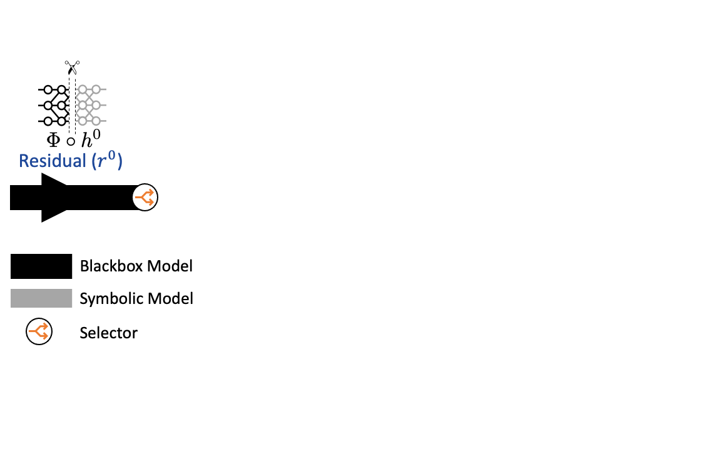

# Dividing and Conquering a BlackBox to a Mixture of Interpretable Models: Route, Interpret, Repeat #

### [Project Page](https://shantanu48114860.github.io/projects/ICML-2023-MoIE/) | [Paper]() | [Arxiv](https://arxiv.org/pdf/2302.10289.pdf)

Official PyTorch implementation of the paper <br/>
**[Dividing and Conquering a BlackBox to a Mixture of Interpretable Models: Route, Interpret, Repeat](https://arxiv.org/pdf/2302.10289.pdf)** <br/>
[Shantanu Ghosh<sup>1</sup>](https://shantanu48114860.github.io/),
[Ke Yu<sup>2</sup>](https://gatechke.github.io/),
[Forough Arabshahi<sup>3</sup>](https://forougha.github.io/),
[Kayhan Batmanghelich<sup>1</sup>](https://www.batman-lab.com/)
<br/>
<sup>1</sup>BU ECE, <sup>2</sup>Pitt ISP, <sup>3</sup>META AI <br/>
In [ICML, 2023](https://icml.cc/Conferences/2023/Dates) <br/>

## Table of Contents

1. [Objective](#objective)
2. [Environment setup](#environment-setup)
3. [Downloading data](#downloading-data)
    * [(a) Downloading vision and skin data](#a-downloading-vision-and-skin-data)
    * [(b) Downloading MIMIC-CXR](#b-downloading-mimic-cxr)
4. [Data preprocessing](#data-preprocessing)
    * [(a) Preprocessing CUB200](#a-preprocessing-cub200)
    * [(b) Preprocessing MIMIC-CXR](#b-preprocessing-mimic-cxr)
5. [Training pipeline](#training-pipleline)
    * [(a) Running MoIE](#a-running-moie)
    * [(b) Compute the performance metrics](#b-compute-the-performance-metrics)
    * [(c) Validating the concept importance](#c-validating-the-concept-importance)
6. [Generated Local Explanations](#generated-local-explanations)
7. [Suggestions](#suggestions)
8. [Checkpoints](#checkpoints)
9. [How to Cite](#how-to-cite)
10. [License and copyright](#license-and-copyright)
11. [Contact](#contact)

## Objective

In this paper, we aim to blur the dichotomy of explaining a Blackbox post-hoc and building inherently interpretable by
design models. Beginning with a Blackbox, we iteratively *carve out* a mixture of interpretable experts (MoIE) and a *
residual network*. Each interpretable model specializes in a subset of samples and explains them using First Order
Logic (FOL). We route the remaining samples through a flexible residual. We repeat the method on the residual network
until all the interpretable models explain the desired proportion of data. Thus, illustration of our method is
summarized below:

<br/>

Refer below for the example of the explanations generated by MoIE:
<br/>

## Environment setup

```bash
conda env create --name python_3_7_rtx_6000 -f environment.yml
conda activate python_3_7_rtx_6000
```

## Downloading data

### (a) Downloading vision and skin data

| Dataset   | Description                        | URL                                                                                 |
|-----------|------------------------------------|-------------------------------------------------------------------------------------|
| CUB-200   | Bird Classification dataset        | [CUB-200 Official](https://www.vision.caltech.edu/datasets/cub_200_2011/)           |
| Derm7pt   | Dermatology Concepts Dataset       | [Get access here](https://derm.cs.sfu.ca/Welcome.html)                              |
| HAM10k    | Skin lesion classification dataset | [Kaggle Link](https://www.kaggle.com/kmader/skin-cancer-mnist-ham10000)             |
| SIIM_ISIC | Skin Melanoma classification       | [SIIM-ISIC Kaggle](https://www.kaggle.com/c/siim-isic-melanoma-classification/data) |
| Awa2      | Animals with Attributes2           | [Awa2 official](https://cvml.ista.ac.at/AwA2/)                                      |

### (b) Downloading MIMIC-CXR

- [MIMIC-CXR](https://physionet.org/content/mimic-cxr-jpg/2.0.0/)
- [RadGraph](https://physionet.org/content/radgraph/1.0.0/)
- [NVIDIA Annotation](https://github.com/leotam/MIMIC-CXR-annotations)
- [Chest ImaGenome](https://physionet.org/content/chest-imagenome/1.0.0/)

For more details please follow the [AGXNet Repository](https://github.com/batmanlab/AGXNet).

## Data preprocessing

### (a) Preprocessing CUB200

To get the CUB200 metadata and dataset splits
follow [Logic Explained network](https://github.com/pietrobarbiero/logic_explained_networks/tree/master/data).

To preprocess the concepts for CUB200, follow:

``` python
python ./src/codebase/data_preprocessing/download_cub.py
```

### (b) Preprocessing MIMIC-CXR

To preprocess MIMIC-CXR for Effusion, follow the following steps sequentially:

1. To generate itemized RadGraph examples, run:

``` python
python ./src/codebase/data_preprocessing/mimic-cxr/miccai-main/preprocessing/radgraph_itemized.py
```

2. Run `./preprocessing/radgraph_parsed.py` To parse RadGraph relations, run:

``` python
python ./src/codebase/data_preprocessing/mimic-cxr/miccai-main/preprocessing/radgraph_parsed.py
```

3. To create adjacency matrix that represents the relations between anatomical landmarks and observations mentioned in
   radiology reports, run:

``` python
python ./src/codebase/data_preprocessing/mimic-cxr/miccai-main/preprocessing/adj_matrix.py
```

Step 3 will be the concepts for training MoIE-CXR.

## Training pipeline

All the scripts for training MoIE, is included in [`./src/scripts`](/src/scripts) folder for all the datasets and
architectures with comments. Follow every command sequentially of each script to train/test the Blackbox (BB), concept
predictor (t), explainers (g) and residuals (r).

* As a first step find and replace the project path `/ocean/projects/asc170022p/shg121/PhD/ICLR-2022` from the whole
  codebase with appropriate path.

* Also, after training and testing MoIE, as the last step in each
  script, [`FOLs_vision_main.py`](/src/codebase/FOLs_vision_main.py) file is responsible for generating instance
  specific FOL. This file
  uses [`./src/codebase/Completeness_and_interventions/paths_MoIE.json`](/src/codebase/Completeness_and_interventions/paths_MoIE.json)
  file where we keep all the paths and filenames of the checkpoints of Blackbox (bb), concept predictor (t), explainer (
  g), and residual (r). Replace those paths and filenames with the appropriate ones based on the experiments. Refer
  below for the description of the
  variables [`paths_MoIE.json`](/src/codebase/Completeness_and_interventions/paths_MoIE.json):

| Variable                 | Description                                                                   |
|--------------------------|-------------------------------------------------------------------------------|
| `cub_ViT-B_16`           | Root variable for CUB200 dataset with Vision Transformer as the Blackbox (BB) |
| `cub_ResNet101`          | Root variable for CUB200 dataset with Resnet101 as the Blackbox (BB)          |
| `HAM10k_Inception_V3`    | Root variable for HAM10k dataset with Inception_v3 as the Blackbox (BB)       |
| `SIIM-ISIC_Inception_V3` | Root variable for SIIM-ISIC dataset with Inception_v3 as the Blackbox (BB)    |
| `awa2_ViT-B_16`          | Root variable for Awa2 dataset with Vision Transformer as the Blackbox (BB)   |
| `awa2_ResNet101`         | Root variable for Awa2 dataset with Resnet101 as the Blackbox (BB)            |

* Note the root follow dataset_BB_architecture format. **Do not modify this format**. For each of the above
  roots [`paths_MoIE.json`](/src/codebase/Completeness_and_interventions/paths_MoIE.json) file, based on the dataset and
  architectures, edit the values in `MoIE_paths`, `t`
  , `bb` with appropriate checkpoint paths and files for the different experts (g), concept predictors (t) and
  Blackbox (
  bb).

* Similarly, edit the checkpoint paths and files
  of [`./src/codebase/MIMIC_CXR/paths_mimic_cxr_icml.json`](/src/codebase/MIMIC_CXR/paths_mimic_cxr_icml.json) for
  effusion of MIMIC-CXR.

**Refer to the following sections for details of each of the scripts.**

### (a) Running MoIE

| Script name                                                         | Description                                                            | Comment                                                                                                                      |
|---------------------------------------------------------------------|------------------------------------------------------------------------|------------------------------------------------------------------------------------------------------------------------------|
| [`./src/scripts/cub_resnet.sh`](/src/scripts/cub_resnet.sh)         | Script for CUB200 dataset with Resnet101 as the Blackbox (BB)          | Included train/test and FOL generation script for the Blackbox (BB), concept predictor (t), explainers (g) and residuals (r) |
| [`./src/scripts/cub_vit.sh`](/src/scripts/cub_vit.sh)               | Script for CUB200 dataset with Vision Transformer as the Blackbox (BB) | Included train/test and FOL generation script for the Blackbox (BB), concept predictor (t), explainers (g) and residuals (r) |
| [`./src/scripts/awa2_resnet.sh`](/src/scripts/awa2_resnet.sh)       | Script for Awa2 dataset with Resnet101 as the Blackbox (BB)            | Included train/test and FOL generation script for the Blackbox (BB), concept predictor (t), explainers (g) and residuals (r) |
| [`./src/scripts/awa2_vit.sh`](/src/scripts/awa2_vit.sh)             | Script for Awa2 dataset with Vision Transformer as the Blackbox (BB)   | Included train/test and FOL generation script for the Blackbox (BB), concept predictor (t), explainers (g) and residuals (r) |
| [`./src/scripts/ham_10k.sh`](/src/scripts/ham_10k.sh)               | Script for HAM10k dataset with Inception_v3 as the Blackbox (BB)       | Included train/test and FOL generation script for the Blackbox (BB), concept predictor (t), explainers (g) and residuals (r) |
| [`./src/scripts/SIIM-ISIC.sh`](/src/scripts/SIIM-ISIC.sh)           | Script for SIIM-ISIC dataset with Inception_v3 as the Blackbox (BB)    | Included train/test and FOL generation script for the Blackbox (BB), concept predictor (t), explainers (g) and residuals (r) |
| [`./src/scripts/mimic_effusion.sh`](/src/scripts/mimic_effusion.sh) | Script for MIMIC-CXR dataset with Densenet121 as the Blackbox (BB)     | Included train/test and FOL generation script for the Blackbox (BB), concept predictor (t), explainers (g) and residuals (r) |  

For reference, check the following repositories for SOTA Blackboxes and concepts:

* [ResNet-101 on CUB-200](https://github.com/zhangyongshun/resnet_finetune_cub)
* [VIT-B_16 on CUB-200](https://github.com/TACJu/TransFG)
* [Models and concepts for HAM10k and ISIC](https://github.com/mertyg/post-hoc-cbm)

### (b) Compute the performance metrics

To compute, the performance metrics (accuracy/AUROC) for all the experts cumulatively (Table 2 in the paper), please
refer below for the ipython notebooks.

| Notebook                                                                                                                            | Description                                                            |
|-------------------------------------------------------------------------------------------------------------------------------------|------------------------------------------------------------------------|
| [`./src/codebase/iPython/Cumulative_performance/CUB-Resnet.ipynb`](/src/codebase/iPython/Cumulative_performance/CUB-Resnet.ipynb)   | Script for CUB200 dataset with Resnet101 as the Blackbox (BB)          |
| [`./src/codebase/iPython/Cumulative_performance/CUB-VIT.ipynb`](/src/codebase/iPython/Cumulative_performance/CUB-VIT.ipynb)         | Script for CUB200 dataset with Vision Transformer as the Blackbox (BB) |
| [`./src/codebase/iPython/Cumulative_performance/AWA2-Resnet.ipynb`](/src/codebase/iPython/Cumulative_performance/AWA2-Resnet.ipynb) | Script for Awa2 dataset with Resnet101 as the Blackbox (BB)            |
| [`./src/codebase/iPython/Cumulative_performance/AWA2-VIT.ipynb`](/src/codebase/iPython/Cumulative_performance/AWA2-VIT.ipynb)       | Script for Awa2 dataset with Vision Transformer as the Blackbox (BB)   |
| [`./src/codebase/iPython/Cumulative_performance/HAM10k.ipynb`](/src/codebase/iPython/Cumulative_performance/HAM10k.ipynb)           | Script for HAM10k dataset with Inception_v3 as the Blackbox (BB)       | 
| [`./src/codebase/iPython/Cumulative_performance/ISIC.ipynb`](/src/codebase/iPython/Cumulative_performance/ISIC.ipynb)               | Script for SIIM-ISIC dataset with Inception_v3 as the Blackbox (BB)    |

For effusion in MIMIC-CXR, the command to estimate the AUROC of all the experts is:

``` python
python ./src/codebase/performance_calculation_mimic_cxr_main.py --iterations 3 --icml "y" --disease "effusion" --model "MoIE"
```

This command is already included in the file [`./src/scripts/mimic_effusion.sh`](/src/scripts/mimic_effusion.sh).

### (c) Validating the concept importance

In the paper, we validated in the importance of the extracted concepts using three experiments:

1. Zeroing out the important concepts
2. Computing the completeness scores of the important concept
    * Before running the script for completeness score, run the following scripts to create the dataset to train the
      projection model in completeness score paper:

| Notebook                                                                                                                        | Description                                                            |
|---------------------------------------------------------------------------------------------------------------------------------|------------------------------------------------------------------------|
| [`./src/codebase/iPython/Completeness_dataset/CUB_Resnet.ipynb`](/src/codebase/iPython/Completeness_dataset/CUB_Resnet.ipynb)   | Script for CUB200 dataset with Resnet101 as the Blackbox (BB)          |
| [`./src/codebase/iPython/Completeness_dataset/CUB_VIT.ipynb`](/src/codebase/iPython/Completeness_dataset/CUB_VIT.ipynb)         | Script for CUB200 dataset with Vision Transformer as the Blackbox (BB) |
| [`./src/codebase/iPython/Completeness_dataset/Awa2_Resnet.ipynb`](/src/codebase/iPython/Completeness_dataset/Awa2_Resnet.ipynb) | Script for Awa2 dataset with Resnet101 as the Blackbox (BB)            |
| [`./src/codebase/iPython/Completeness_dataset/Awa2_VIT.ipynb`](/src/codebase/iPython/Completeness_dataset/Awa2_VIT.ipynb)       | Script for Awa2 dataset with Vision Transformer as the Blackbox (BB)   |
| [`./src/codebase/iPython/Completeness_dataset/HAM10k.ipynb`](/src/codebase/iPython/Completeness_dataset/HAM10k.ipynb)           | Script for HAM10k dataset with Inception_v3 as the Blackbox (BB)       | 

3. Performing test time interventions

Please refer to the table below for the scripts to replicate the above experiments (zeroing out the concepts,
completeness scores and test time interventions):

| Scripts                                                                       | Description                                                                                                                                        |
|-------------------------------------------------------------------------------|----------------------------------------------------------------------------------------------------------------------------------------------------|
| [`./src/scripts/zero_out_concepts.sh`](/src/scripts/zero_out_concepts.sh)     | Script to zero out the important concepts                                                                                                          |
| [`./src/scripts/completeness_scores.sh`](/src/scripts/completeness_scores.sh) | Script to estimate the completeness scores of the important concepts                                                                               |
| [`./src/scripts/tti.sh`](/src/scripts/tti.sh)                                 | Script to perform test time interventions for the important concepts                                                                               |
| [`./src/codebase/tti_experts.sh`](/src/scripts/tti_experts.sh)                | Script to perform test time interventions for the important concepts corresponding to only the ** harder** samples covered by the last two experts |

## Generated Local Explanations

We have included the instance-specific explanations per expert for each dataset in the folder [`./explanations`](
/explanations).

## Suggestions

Most of the *argparse* variables are self-explanatory. However, in order to perform the experiments successfully, give
the correct paths and files to the following variables in `train_explainer_<dataset>.py` and  
`test_explainer_<dataset>.py`.

* For `train_explainer_<dataset>.py` (ex. [`train_explainer_CUB.py`](src/codebase/train_explainer_CUB.py)
  , [`train_explainer_ham10k.py`](src/codebase/train_explainer_ham10k.py) etc.), follow the rules:

    1. `--checkpoint-model` : Don't include this variable for the 1st iteration. For 2nd iteration and onwards, include
       the checkpoint files of all the experts of **previous iterations while training for the expert (
       g) (`--expert-to-train "explainer"`)**. For example: if the current iteration is 3, include the checkpoint files
       for the expert 1 and expert 2 sequentially. While **training the residual (`--expert-to-train "residual"`)**,
       include the checkpoint files of all the experts **including the current iteration**.
    2. `--checkpoint-residual` : Don't include this variable for the 1st iteration. For 2nd iteration and onwards,
       include the checkpoint files of all the residuals of **previous iterations** while training the expert (
       g) (`--expert-to-train "explainer"`) and the residual (`--expert-to-train "explainer"`). For example: if the
       current iteration is 3, include the checkpoint files for the residual 1 and residual 2 sequentially.
    3. `--prev_explainer_chk_pt_folder` : Don't include this variable for the 1st iteration. For 2nd iteration and
       onwards, include the folders of the checkpoint files of all the experts of **previous iterations**. For example:
       if the current iteration is 3, include the checkpoint folders for the expert 1 and expert 2 sequentially. For all
       the datasets other than MIMIC-CXR, include the absolute path. For MIMIC-CXR, only include the experiment folder
       where the checkpoint file will be stored.

  Refer to the following example command for the 3rd iteration for CUB200 dataset with VIT as the blackbox to train the
  expert:
    ``` python
    python ./src/codebase/train_explainer_CUB.py --expert-to-train "explainer" --checkpoint-model checkpt_expert1 checkpt_expert2 --checkpoint-residual checkpt_residual1 checkpt_residual2 --prev_explainer_chk_pt_folder checkpt_folder_exper1 checkpt_folder_expert2 --root-bb "lr_0.03_epochs_95" --checkpoint-bb "VIT_CUBS_8000_checkpoint.bin" --iter 3 --dataset "cub" --cov cov_iter1 cov_iter2 cov_iter3 --bs 16 --dataset-folder-concepts "lr_0.03_epochs_95_ViT-B_16_layer4_VIT_sgd_BCE" --lr learning_rate_iter1 learning_rate_iter2 learning_rate_iter3 --input-size-pi 2048 --temperature-lens 0.7 --lambda-lens 0.0001 --alpha-KD 0.9 --temperature-KD 10 --hidden-nodes 10 --layer "VIT" --arch "VIT-B_16" 
    ```

  Similarly, refer to the following example command for the 3rd iteration for **CUB200** dataset with **VIT** as the
  blackbox to train the residual:
    ``` python
    python ./src/codebase/train_explainer_CUB.py --expert-to-train "residual" --checkpoint-model checkpt_expert1 checkpt_expert2 checkpt_expert3 --checkpoint-residual checkpt_residual1 checkpt_residual2 --prev_explainer_chk_pt_folder checkpt_folder_exper1 checkpt_folder_expert2 --root-bb "lr_0.03_epochs_95" --checkpoint-bb "VIT_CUBS_8000_checkpoint.bin" --iter 3 --dataset "cub" --cov cov_iter1 cov_iter2 cov_iter3 --bs 16 --dataset-folder-concepts "lr_0.03_epochs_95_ViT-B_16_layer4_VIT_sgd_BCE" --lr learning_rate_iter1 learning_rate_iter2 learning_rate_iter3 --input-size-pi 2048 --temperature-lens 0.7 --lambda-lens 0.0001 --alpha-KD 0.9 --temperature-KD 10 --hidden-nodes 10 --layer "VIT" --arch "VIT-B_16"  
    ```

* For `test_explainer_<dataset>.py` (ex. [`test_explainer_CUB.py`](src/codebase/test_explainer_CUB.py)
  , [`test_explainer_ham10k.py`](src/codebase/test_explainer_ham10k.py) etc.), follow the rules:

    1. `--checkpoint-model` : Don't include this variable for the 1st iteration. For 2nd iteration and onwards, include
       the checkpoint files of all the experts **including the current iteration** while testing the expert (
       g) (`--expert-to-train "explainer"`) and the residual (`--expert-to-train "explainer"`).
    2. `--checkpoint-residual` : Don't include this variable for the 1st iteration. For 2nd iteration and onwards,
       include the checkpoint files of all the residuals of **previous iterations** while training for the expert (
       g) (`--expert-to-train "explainer"`)**. For example: if the current iteration is 3, include the checkpoint files
       for the residual 1 and residual 2 sequentially. While **testing the residual (`--expert-to-train "residual"`)**,
       include the checkpoint files of all the residuals **including the current iteration**.
    3. `--prev_explainer_chk_pt_folder` : Don't include this variable for the 1st iteration. For 2nd iteration and
       onwards, include the folders of the checkpoint files all the experts of **previous iterations**. For example: if
       the current iteration is 3, include the checkpoint folders for the expert 1 and expert 2 sequentially. For all
       the datasets other than MIMIC-CXR, include the absolute path. For MIMIC-CXR, only include the experiment folder
       where the checkpoint file will be stored.

  Refer to the following example command for the 3rd iteration for **CUB200** dataset with **VIT** as the blackbox to
  test the expert:
    ``` python
    python ./src/codebase/test_explainer_CUB.py --expert-to-train "explainer" --checkpoint-model checkpt_expert1 checkpt_expert2 checkpt_expert3 --checkpoint-residual checkpt_residual1 checkpt_residual2 --prev_explainer_chk_pt_folder checkpt_folder_exper1 checkpt_folder_expert2 --root-bb "lr_0.03_epochs_95" --checkpoint-bb "VIT_CUBS_8000_checkpoint.bin" --iter 3 --dataset "cub" --cov cov_iter1 cov_iter2 cov_iter3 --bs 16 --dataset-folder-concepts "lr_0.03_epochs_95_ViT-B_16_layer4_VIT_sgd_BCE" --lr learning_rate_iter1 learning_rate_iter2 learning_rate_iter3 --input-size-pi 2048 --temperature-lens 0.7 --lambda-lens 0.0001 --alpha-KD 0.9 --temperature-KD 10 --hidden-nodes 10 --layer "VIT" --arch "VIT-B_16"  
    ```

  Similarly, refer to the following example command for the 3rd iteration for CUB200 dataset with VIT as the blackbox to
  test the residual:
    ``` python
    python ./src/codebase/test_explainer_CUB.py --expert-to-train "residual" --checkpoint-model checkpt_expert1 checkpt_expert2 checkpt_expert3 --checkpoint-residual checkpt_residual1 checkpt_residual2 checkpt_residual3 --prev_explainer_chk_pt_folder checkpt_folder_exper1 checkpt_folder_expert2 --root-bb "lr_0.03_epochs_95" --checkpoint-bb "VIT_CUBS_8000_checkpoint.bin" --iter 3 --dataset "cub" --cov cov_iter1 cov_iter2 cov_iter3 --bs 16 --dataset-folder-concepts "lr_0.03_epochs_95_ViT-B_16_layer4_VIT_sgd_BCE" --lr learning_rate_iter1 learning_rate_iter2 learning_rate_iter3 --input-size-pi 2048 --temperature-lens 0.7 --lambda-lens 0.0001 --alpha-KD 0.9 --temperature-KD 10 --hidden-nodes 10 --layer "VIT" --arch "VIT-B_16" 
    ```

Also make sure the following variables are correct:

* `--cov`: Coverages of each iteration separated by a space as in the above commands.
* `--lr`: Learning rates of each expert separated by a space as in the above commands.
* `--data-root`: Dataset path of images, labels and concepts (if exists)
* `--logs`: Path of tensorboard logs

## Checkpoints

For the checkpoints of the pretrained blackboxes and concept banks, refer below:

| Blackbox                                                                                           | Concept predictor (t) / Concept banks                                                              |
|----------------------------------------------------------------------------------------------------|----------------------------------------------------------------------------------------------------|
| [CUB200-VIT](https://drive.google.com/drive/u/1/folders/1nDmJklw3UJy_75Oh23BvzCw6VkGFWet1)         | [CUB200-VIT](https://drive.google.com/drive/u/1/folders/1fSI231IcaClK6OAZrIg6ptVXRaeIpGkh)         |
| [HAM10k](https://drive.google.com/drive/u/1/folders/1Honi_YBX-ktOkLRH5NKuIay9-AjX4gyU)             | [HAM10k](https://drive.google.com/drive/u/1/folders/1w8Xc2xb9Y7kcMcXnP5rtNXcis-be3tAH)             |
| [Effusion-MIMIC-CXR](https://drive.google.com/drive/u/1/folders/1h3mUuf6rvV8R0uzUKCkScgtxON13exoR) | [Effusion-MIMIC-CXR](https://drive.google.com/drive/u/1/folders/1eza7ZPhbwGwvhdyakem8pLP16bqtmrz7) |
| [Awa2-VIT](https://drive.google.com/drive/u/1/folders/1MwYpobXz8gZSvYsD1-kEbFKEBWviauDV)           | [Awa2-VIT](https://drive.google.com/drive/u/1/folders/1DVvIyFOAPqjvM4J8ak6vmn_XdIvTso0D)           |

Note for HAM10k, we add the extracted concept bank after training `t`. No need to train t for HAM10k and SIIM-ISIC, if
this concept bank is used. For others, the above paths contain the checkpoints of `t`. Use these checkpoints to extract
the concepts.

## How to Cite

```
@misc{ghosh2023dividing,
      title={Dividing and Conquering a BlackBox to a Mixture of Interpretable Models: Route, Interpret, Repeat}, 
      author={Shantanu Ghosh and Ke Yu and Forough Arabshahi and Kayhan Batmanghelich},
      year={2023},
      eprint={2302.10289},
      archivePrefix={arXiv},
      primaryClass={cs.LG}
}
```

## License and copyright

Licensed under the [MIT License](LICENSE)

Copyright © [Batman Lab](https://www.batman-lab.com/), 2023

## Contact

For any queries, contact: **shawn24@bu.edu**
